# AMOEBA

This repo contains source code to AMOEBA: Automated Recovery from Domain Drift in Video Analytics.

The relevant files and directory are as follows:

1. Drift Detection with AMOEBA: `drift_detection_amoeba.py`
2. Drift Recovery with AMOEBA: `drift_recovery_amoeba.py`
3. DAGAN training for ODIN: `odin/train_dagan.py`
4. Drift Detection with ODIN: `odin/drift_detection_odin.py`
5. Drift Recovery with FIXMATCH: `fixmatch/drift_recovery_fixmatch.py`
6. CYCLEGAN training: `cyclegan/train_cyclegan.py`
7. Drift Recovery with CYCLEGAN+: `cyclegan/dirft_recovery_cyclegan.bash`

### Example Images of SSD Retrained with AMOEBA

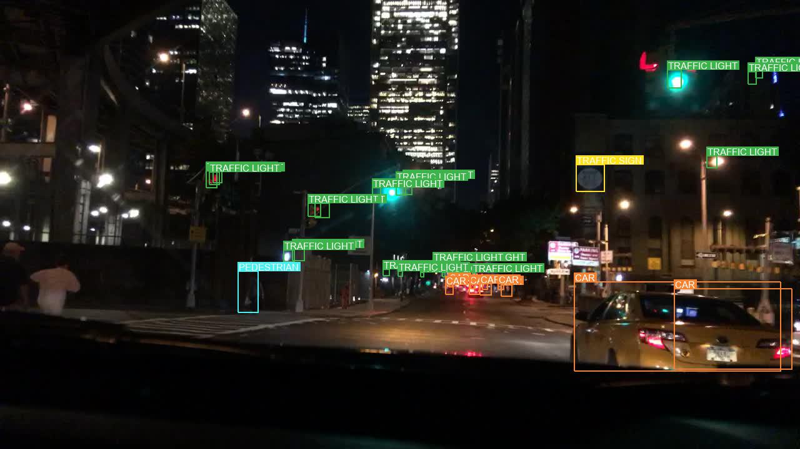
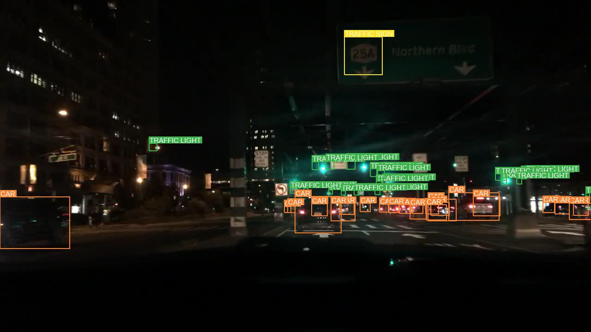
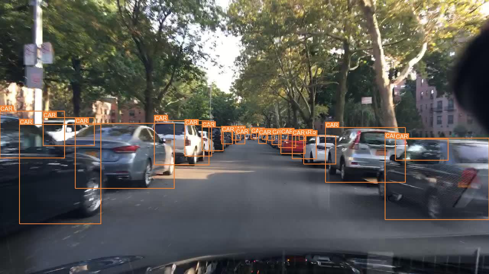
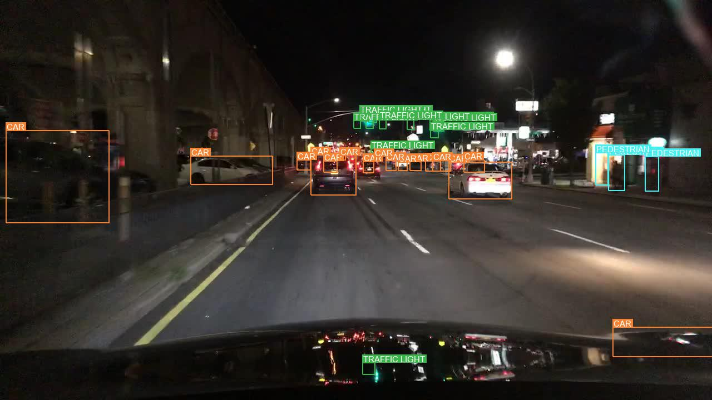
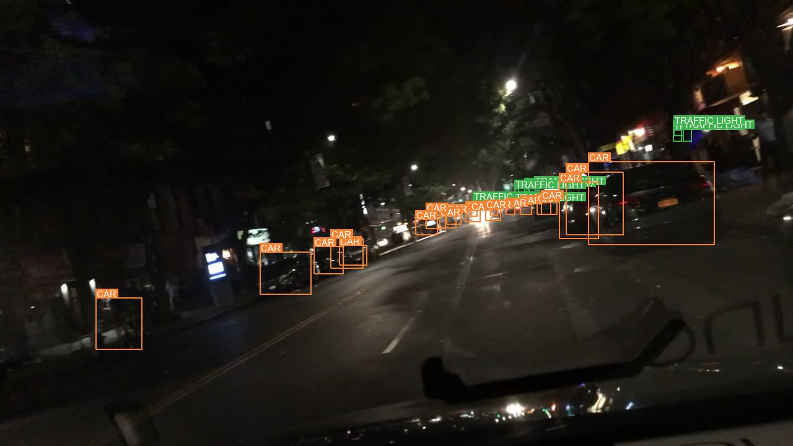
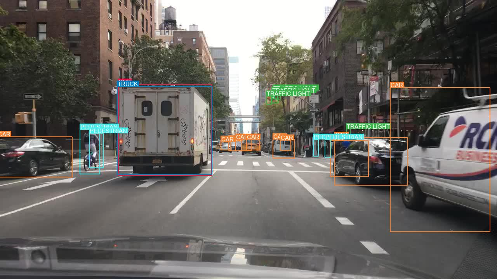
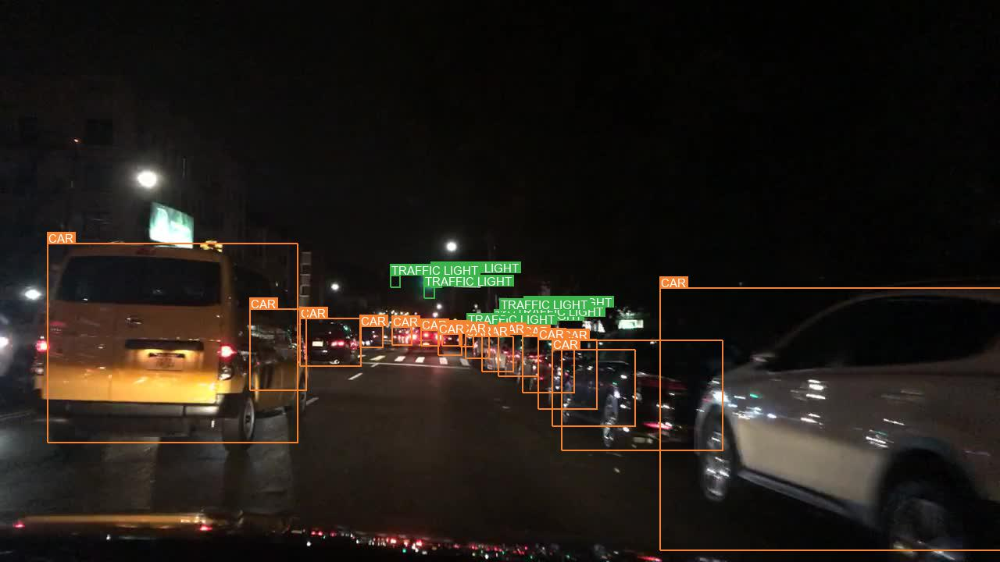

### Example Images of SSD experiencing drift

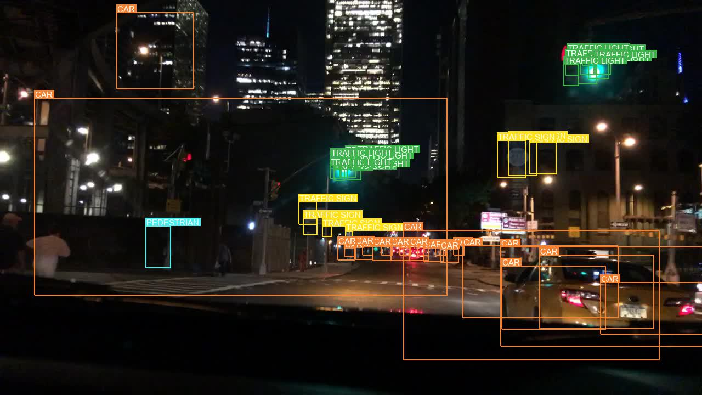
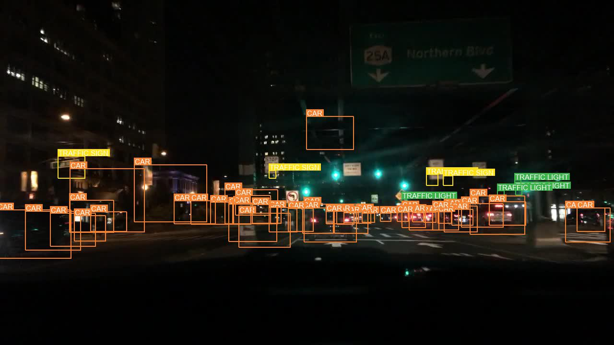
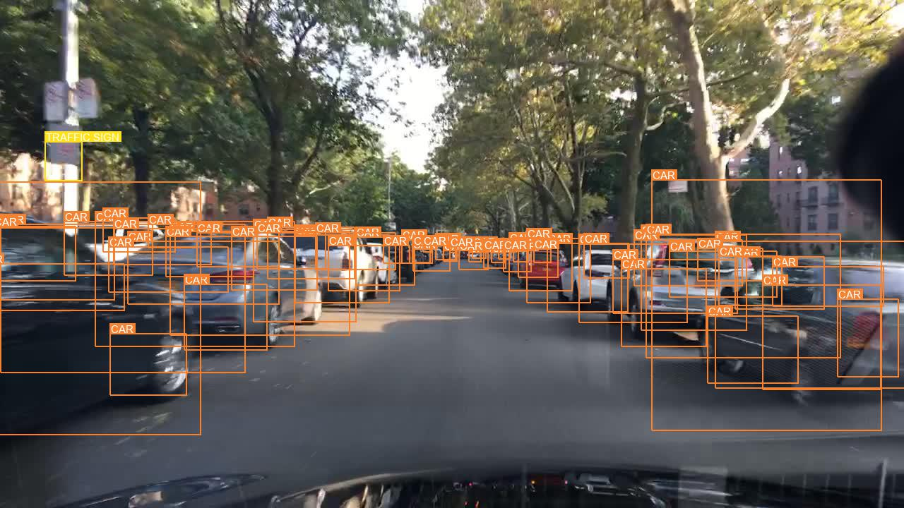
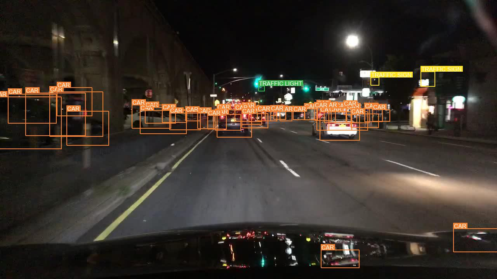
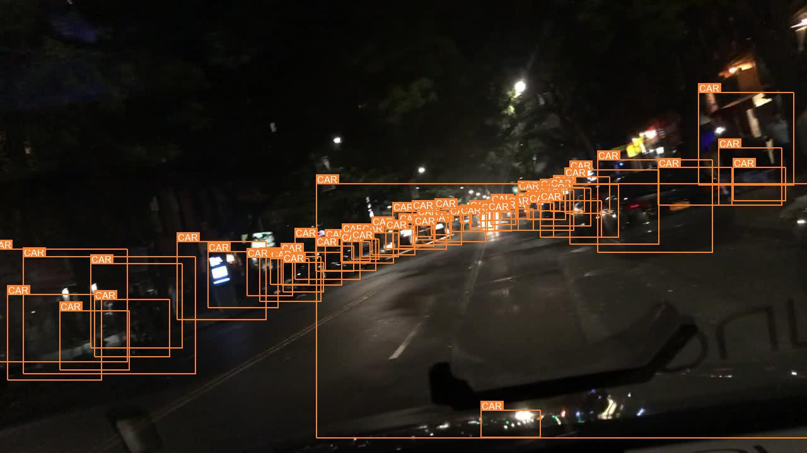
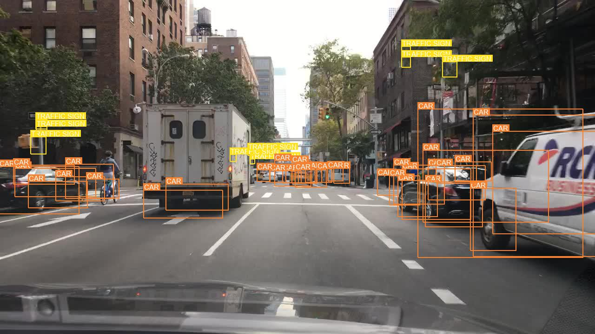

